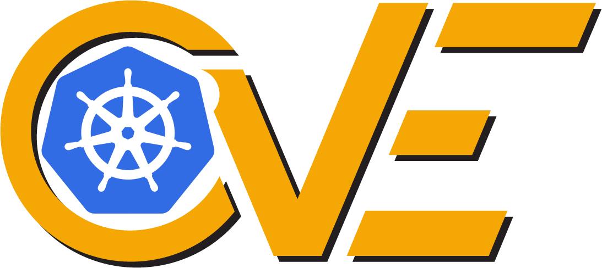
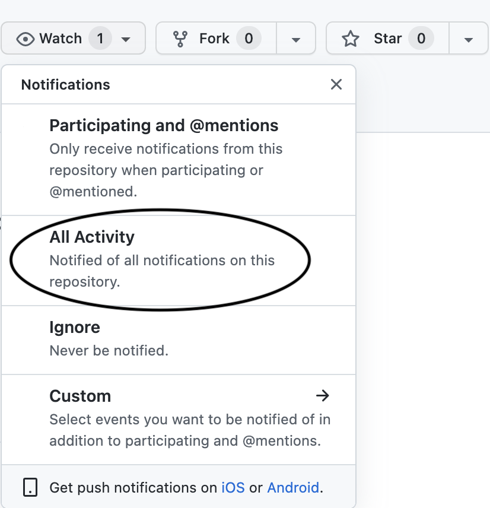

# Kubernetes-Sec-Alert - Track Kubernetes CVEs by native GitHub notifications!

## How it works
- Scheduled script every hour fetches the cves list from the [Official Kubernetes CVE Feed](https://kubernetes.io/docs/reference/issues-security/official-cve-feed/) and opens an issue labeled with the CVE id.
- All repository subscribers receive a GitHub notification with the new kubernetes CVEs in the web interface notification or by email.

## How to subscribe
- You can subscribe to new issue by watching this repoistory.

## Contributing
Contributions are what make the open source community such an amazing place to be learn, inspire, and create. Any contributions you make are **greatly appreciated**.

1. Fork the Project
2. Create your Feature Branch (`git checkout -b feature/AmazingFeature`)
3. Commit your Changes (`git commit -m 'Add some AmazingFeature'`)
4. Push to the Branch (`git push origin feature/AmazingFeature`)
5. Open a Pull Request

## Authors
- [Mostafa Hussein](https://github.com/mostafahussein)